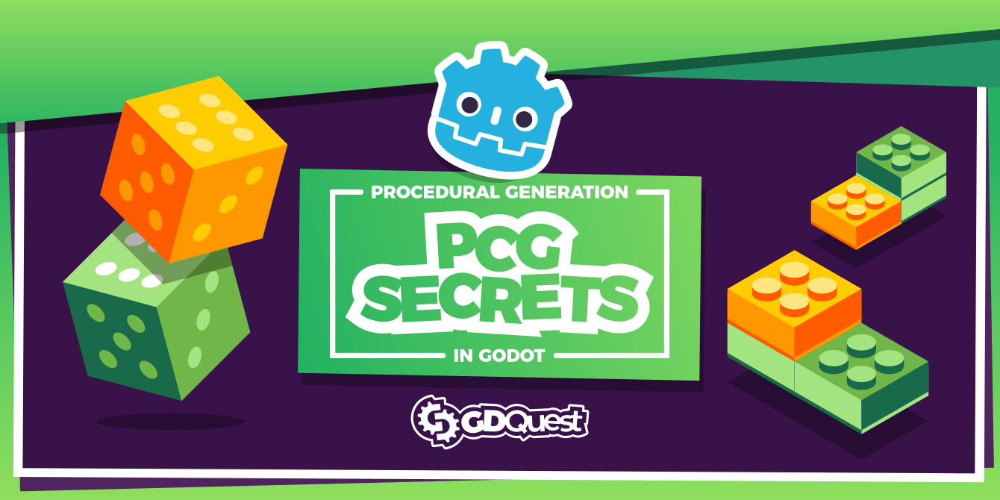
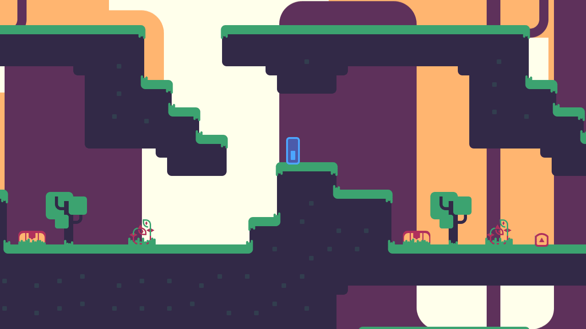
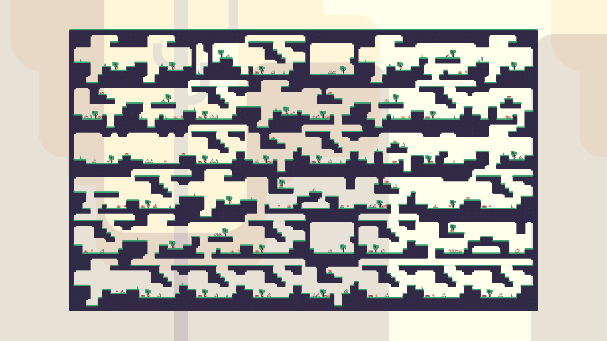
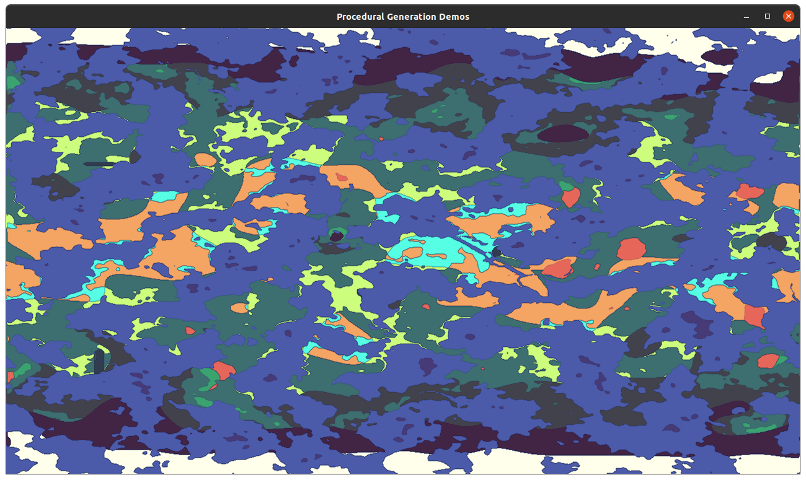

# Godot Procedural Generation

Godot PCG (Procedural Content Generation) is a project to build a series of algorithms and demos to learn about procedural generation. The algorithms are from our course [Godot PCG Secrets](https://gdquest.mavenseed.com/courses/pcg-secrets-the-art-of-procedural-generation-in-godot).

➡ Follow us on [Twitter](https://twitter.com/NathanGDQuest) and [YouTube](https://www.youtube.com/c/gdquest/) for free game creation tutorials, tips, and news! Get one of our [Godot game creation courses](https://gdquest.mavenseed.com/) to support our work on Free Software.

## Available demos

### RandomWalker

This is an algorithm as seen in Spelunky. This algorithm uses a node that walks randomly on a grid, places hand-designed level chunks, and randomizes them to generate unique levels.

### WorldMap

This project demonstrates a technique for generating world map with biomes and rivers, heavily relying on shaders. It's inspired by [Procedurally Generated Wrapping World Maps in Unity C#](http://www.jgallant.com/procedurally-generating-wrapping-world-maps-in-unity-csharp-part-1/) although it uses a completely different implementation.

### BasicDungeonGenerator

A basic generator to get started with procedural content generation. Creates rectangular rooms, rooms with organic shapes, and corridors connecting the rooms.

### ModularWeapons

Procedural or emergent gameplay system where you can stack movement modifiers and different emitters to generate weapons. A game that references techniques like this are Binding of Isaac or Enter the Gungeon.

### SpaceInfiniteGeneration

Three infinite world generations you can keep travelling through: one that generates a world of asteroids using pure, random white noise, one that uses blue noise (massaged white noise), and one more complete example that generates planets, moons, trade lanes and asteroid rings.

## How to use

Clone the repository. Each demo is in a separate directory.

In the demos, where relevant, we use a timer to show you the content generation steps, as the final level would otherwise appear instantly. Doing so helps to visualize and debug algorithms. Remove that timer code for the algorithm to run at full speed.

## Contributing

Contributors are welcome!

If you encounter a bug, please [open an issue](https://github.com/GDQuest/godot-game-harvester/issues/new).

If you want to contribute to the project, for instance by fixing a bug or adding a feature, check out our:

1. [Contributor guidelines](https://www.gdquest.com/docs/guidelines/contributing-to/gdquest-projects/).
1. [GDScript style guide](https://www.gdquest.com/docs/guidelines/best-practices/godot-gdscript/)

## Licenses

This project is dual-licensed:

- The source code is available under the MIT license.
- Art assets (images, audio files) are [CC-By 4.0](https://creativecommons.org/licenses/by/4.0/). You can attribute them to `GDQuest and contributors (https://www.gdquest.com/)`.
